# System Architecture

**Purpose:** Document the complete data flow from GAMS input to KKT output, with all key data structures and API boundaries clearly marked.

**Created:** 2025-10-29  
**Last Updated:** 2025-10-30  
**Related:** Sprint 3 Prep Plan Task 1, Sprint 3 Summary

---

## Table of Contents

1. [High-Level Data Flow](#high-level-data-flow)
2. [Module Boundaries](#module-boundaries)
3. [Critical API Contracts](#critical-api-contracts)
4. [Sprint Integration Map](#sprint-integration-map)
5. [Issue Root Cause Analysis](#issue-root-cause-analysis)

---

## High-Level Data Flow

### Mermaid Flowchart (Interactive)

```mermaid
flowchart TD
    GAMS[("GAMS File (.gms)<br/>Sets, Variables,<br/>Equations, Solve NLP")]
    
    PARSER["Parser (Sprint 1)<br/>src/gams/parser.py<br/>• Lark grammar parsing<br/>• Build AST expressions<br/>• Create symbol tables"]
    
    PARSED["ParsedModel<br/>• Raw AST<br/>• Symbol definitions<br/>• Unparsed relations"]
    
    NORMALIZER["Normalizer (Sprint 1)<br/>src/ir/normalize.py<br/>• Convert =l=/=g= to ≤ 0<br/>• Extract bounds<br/>• Normalize equations"]
    
    MODELIR["ModelIR (Sprint 1 Output)<br/>src/ir/model_ir.py<br/>• sets, variables, equations<br/>• equalities, inequalities<br/>• normalized_bounds<br/>• objective"]
    
    INDEXMAP["Variable Instance Mapper<br/>(Sprint 2)<br/>src/ad/index_mapping.py<br/>• Enumerate var instances<br/>• Map (var, indices) → col_id<br/>• Map (eq, indices) → row_id"]
    
    MAPPING["IndexMapping<br/>• instances<br/>• var_to_col<br/>• eq_to_row"]
    
    GRADIENT["Gradient Computer<br/>(Sprint 2)<br/>src/ad/gradient.py<br/>• Find objective expr<br/>• Differentiate w.r.t. vars<br/>• Index-aware matching"]
    
    JACOBIAN["Jacobian Computer<br/>(Sprint 2)<br/>src/ad/constraint_jacobian.py<br/>• Diff equalities<br/>• Diff inequalities<br/>• Diff bounds"]
    
    GRADVEC["GradientVector<br/>• num_cols<br/>• entries: dict[int, Expr]<br/>• index_mapping<br/><br/>✓ Use num_cols or index_mapping.num_vars"]
    
    JACSTRUCT["JacobianStructure<br/>• num_rows, num_cols<br/>• entries: dict[dict]<br/>• index_mapping"]
    
    PARTITION["Constraint Partitioner<br/>(Sprint 3)<br/>src/kkt/partition.py<br/>• Separate eq/ineq/bounds<br/>• Exclude duplicates<br/>• Skip infinite bounds<br/>• Handle indexed bounds"]
    
    PARTRESULT["PartitionResult<br/>• equalities<br/>• inequalities<br/>• bounds_lo/up/fx<br/>• skipped_infinite<br/>• duplicate_excluded"]
    
    OBJECTIVE["Objective Extractor<br/>(Sprint 3)<br/>src/kkt/objective.py<br/>• Extract objvar info<br/>• Find defining equation<br/>• Determine stationarity"]
    
    OBJINFO["ObjectiveInfo<br/>• objvar<br/>• defining_equation<br/>• needs_stationarity"]
    
    NAMING["Multiplier Naming<br/>(Sprint 3)<br/>src/kkt/naming.py<br/>• Generate nu_ names<br/>• Generate lambda_ names<br/>• Generate pi_lo/up_ names"]
    
    STATIONARITY["Stationarity Builder<br/>(Sprint 3)<br/>src/kkt/stationarity.py<br/>• ∇f + J^T·multipliers = 0<br/>• Per-variable equations<br/>• Handle indexed vars"]
    
    COMPLEMENTARITY["Complementarity Builder<br/>(Sprint 3)<br/>src/kkt/complementarity.py<br/>• F(x) ⊥ λ pairs<br/>• Bound complementarity<br/>• Ineq complementarity"]
    
    KKT["KKT Assembler<br/>(Sprint 3)<br/>src/kkt/assemble.py<br/>• Orchestrate partition<br/>• Orchestrate objective<br/>• Orchestrate multipliers<br/>• Orchestrate stationarity<br/>• Orchestrate complementarity"]
    
    KKTSYS["KKTSystem<br/>• model_ir<br/>• gradient, J_eq, J_ineq<br/>• multipliers (eq/ineq/bounds)<br/>• stationarity<br/>• complementarity<br/>• diagnostics"]
    
    EMITTER["GAMS MCP Emitter<br/>(Sprint 3)<br/>src/emit/emit_gams.py<br/>• Emit sets/params<br/>• Emit variables<br/>• Emit equations<br/>• Emit Model MCP<br/>• Emit Solve MCP"]
    
    MCP[("MCP File (.gms)<br/>Variables, Equations,<br/>Model MCP, Solve MCP")]
    
    GAMS --> PARSER
    PARSER --> PARSED
    PARSED --> NORMALIZER
    NORMALIZER --> MODELIR
    MODELIR --> INDEXMAP
    INDEXMAP --> MAPPING
    MAPPING --> GRADIENT
    MAPPING --> JACOBIAN
    GRADIENT --> GRADVEC
    JACOBIAN --> JACSTRUCT
    MODELIR --> PARTITION
    PARTITION --> PARTRESULT
    MODELIR --> OBJECTIVE
    OBJECTIVE --> OBJINFO
    PARTRESULT --> NAMING
    OBJINFO --> NAMING
    GRADVEC --> STATIONARITY
    JACSTRUCT --> STATIONARITY
    PARTRESULT --> STATIONARITY
    NAMING --> STATIONARITY
    PARTRESULT --> COMPLEMENTARITY
    NAMING --> COMPLEMENTARITY
    MODELIR --> COMPLEMENTARITY
    GRADVEC --> KKT
    JACSTRUCT --> KKT
    MODELIR --> KKT
    PARTRESULT --> KKT
    OBJINFO --> KKT
    STATIONARITY --> KKT
    COMPLEMENTARITY --> KKT
    KKT --> KKTSYS
    KKTSYS --> EMITTER
    EMITTER --> MCP
    
    classDef sprint1 fill:#e1f5e1,stroke:#4caf50,stroke-width:2px
    classDef sprint2 fill:#e3f2fd,stroke:#2196f3,stroke-width:2px
    classDef sprint3 fill:#fff3e0,stroke:#ff9800,stroke-width:2px
    classDef data fill:#f5f5f5,stroke:#666,stroke-width:1px
    
    class PARSER,NORMALIZER sprint1
    class INDEXMAP,GRADIENT,JACOBIAN sprint2
    class PARTITION,OBJECTIVE,NAMING,STATIONARITY,COMPLEMENTARITY,KKT,EMITTER sprint3
    class GAMS,PARSED,MODELIR,MAPPING,GRADVEC,JACSTRUCT,PARTRESULT,OBJINFO,KKTSYS,MCP data
```



**Legend:**
- 🟢 **Green boxes**: Sprint 1 components (Parser, Normalizer)
- 🔵 **Blue boxes**: Sprint 2 components (Index Mapper, Gradient Computer, Jacobian Computer)
- 🟠 **Orange boxes**: Sprint 3 components (Constraint Partitioner, Objective Extractor, Multiplier Naming, Stationarity Builder, Complementarity Builder, KKT Assembler, GAMS MCP Emitter)
- ⚪ **Gray boxes**: Data structures (inputs, outputs, intermediate representations)

### ASCII Diagram (Detailed)

This diagram shows the complete pipeline from GAMS input to MCP output (all sprints completed):

```
┌──────────────────┐
│  GAMS File (.gms)│
│  - Sets          │
│  - Variables     │
│  - Equations     │
│  - Solve NLP     │
└────────┬─────────┘
         │
         ▼
┌──────────────────────────────────────────────┐
│  Parser (Sprint 1)                           │
│  ┌──────────────────────────────────────────┐│
│  │ src/gams/parser.py                       ││
│  │ - Lark grammar-based parsing             ││
│  │ - Builds AST expressions                 ││
│  │ - Creates symbol tables                  ││
│  └──────────────────────────────────────────┘│
└────────┬─────────────────────────────────────┘
         │
         ▼
┌──────────────────────────────────────────────┐
│  ParsedModel (Intermediate)                  │
│  - Raw AST expressions                       │
│  - Symbol definitions                        │
│  - Unparsed equation relations               │
└────────┬─────────────────────────────────────┘
         │
         ▼
┌──────────────────────────────────────────────┐
│  Normalizer (Sprint 1)                       │
│  ┌──────────────────────────────────────────┐│
│  │ src/ir/normalize.py                      ││
│  │ - Converts =l=/=g= to <=0 form           ││
│  │ - Extracts variable bounds               ││
│  │ - Normalizes equations                   ││
│  │ - Populates equalities/inequalities      ││
│  └──────────────────────────────────────────┘│
└────────┬─────────────────────────────────────┘
         │
         ▼
┌──────────────────────────────────────────────┐
│  ModelIR (Sprint 1 Output)                   │
│  ┌──────────────────────────────────────────┐│
│  │ src/ir/model_ir.py                       ││
│  │                                          ││
│  │ • sets: dict[str, SetDef]                ││
│  │ • variables: dict[str, VariableDef]      ││
│  │ • equations: dict[str, EquationDef]      ││
│  │ • equalities: list[str]                  ││
│  │ • inequalities: list[str]                ││
│  │ • normalized_bounds: dict[str, NormalizedEquation] ││
│  │ • objective: ObjectiveIR                 ││
│  └──────────────────────────────────────────┘│
└────────┬─────────────────────────────────────┘
         │
         ▼
┌──────────────────────────────────────────────┐
│  Variable Instance Mapper (Sprint 2)         │
│  ┌──────────────────────────────────────────┐│
│  │ src/ad/index_mapping.py                  ││
│  │ - Enumerates all variable instances      ││
│  │ - Maps (var, indices) → column ID        ││
│  │ - Maps (eq, indices) → row ID            ││
│  └──────────────────────────────────────────┘│
└────────┬─────────────────────────────────────┘
         │
         ▼
┌──────────────────────────────────────────────┐
│  IndexMapping (Sprint 2)                     │
│  - instances: list[VarInstance]              │
│  - var_to_col: dict[(str, tuple), int]       │
│  - eq_to_row: dict[(str, tuple), int]        │
└────────┬─────────────────────────────────────┘
         │
         ├─────────────────────────────────────┐
         │                                     │
         ▼                                     ▼
┌─────────────────────────┐    ┌──────────────────────────────┐
│  Gradient Computer      │    │  Jacobian Computer           │
│  (Sprint 2)             │    │  (Sprint 2)                  │
│  ┌─────────────────────┐│    │  ┌──────────────────────────┐│
│  │ src/ad/gradient.py  ││    │  │ src/ad/constraint_jacobian.py ││
│  │ - Find objective    ││    │  │ - Differentiate equalities││
│  │ - Differentiate     ││    │  │ - Differentiate inequalities││
│  │   w.r.t. each var   ││    │  │ - Differentiate bounds    ││
│  │ - Index-aware       ││    │  │ - Index-aware             ││
│  └─────────────────────┘│    │  └──────────────────────────┘│
└───────────┬─────────────┘    └──────────┬───────────────────┘
            │                             │
            ▼                             ▼
┌─────────────────────────┐    ┌──────────────────────────────┐
│  GradientVector         │    │  JacobianStructure           │
│  (Sprint 2)             │    │  (Sprint 2)                  │
│  ┌─────────────────────┐│    │  ┌──────────────────────────┐│
│  │ src/ad/jacobian.py  ││    │  │ src/ad/jacobian.py       ││
│  │                     ││    │  │                          ││
│  │ • num_cols          ││    │  │ • num_rows               ││
│  │ • entries: dict[int, Expr] ││    │  │ • num_cols               ││
│  │ • index_mapping     ││    │  │ • entries: dict[int, dict[int, Expr]] ││
│  │                     ││    │  │ • index_mapping          ││
│  │ ✓ Use num_cols      ││    │  └──────────────────────────┘│
│  └─────────────────────┘│    │                              │
└─────────────────────────┘    └──────────────────────────────┘
            │                             │
            └──────────┬──────────────────┘
                       │
                       ▼
┌──────────────────────────────────────────────┐
│  Constraint Partitioner (Sprint 3)           │
│  ┌──────────────────────────────────────────┐│
│  │ src/kkt/partition.py                     ││
│  │ - Separate equalities/inequalities/bounds││
│  │ - Exclude duplicate bounds               ││
│  │ - Skip infinite bounds                   ││
│  │ - Handle indexed bounds                  ││
│  └──────────────────────────────────────────┘│
└────────┬─────────────────────────────────────┘
         │
         ▼
┌──────────────────────────────────────────────┐
│  PartitionResult                             │
│  - equalities: list[str]                     │
│  - inequalities: list[str]                   │
│  - bounds_lo/up/fx: dict                     │
│  - skipped_infinite: list                    │
│  - duplicate_excluded: list                  │
└────────┬─────────────────────────────────────┘
         │
         ├─────────────────────────────────────┐
         │                                     │
         │   ┌─────────────────────────────────┤
         │   │                                 │
         ▼   ▼                                 │
┌──────────────────────────────────────────────┐
│  KKT Assembler (Sprint 3)                    │
│  ┌──────────────────────────────────────────┐│
│  │ src/kkt/assemble.py                      ││
│  │ Main orchestrator:                       ││
│  │ - Extract objective info (objective.py)  ││
│  │ - Create multipliers (naming.py)         ││
│  │ - Build stationarity (stationarity.py)   ││
│  │ - Build complementarity (complementarity.py) ││
│  └──────────────────────────────────────────┘│
└────────┬─────────────────────────────────────┘
         │
         ▼
┌──────────────────────────────────────────────┐
│  KKTSystem (Sprint 3)                        │
│  ┌──────────────────────────────────────────┐│
│  │ src/kkt/kkt_system.py                    ││
│  │                                          ││
│  │ • model_ir: ModelIR                      ││
│  │ • gradient: GradientVector               ││
│  │ • J_eq, J_ineq: JacobianStructure        ││
│  │ • multipliers_eq/ineq/bounds_lo/up       ││
│  │ • stationarity: dict[str, EquationDef]   ││
│  │ • complementarity_ineq/bounds_lo/up      ││
│  │ • skipped_infinite_bounds                ││
│  │ • duplicate_bounds_excluded              ││
│  └──────────────────────────────────────────┘│
└────────┬─────────────────────────────────────┘
         │
         ▼
┌──────────────────────────────────────────────┐
│  GAMS MCP Emitter (Sprint 3)                 │
│  ┌──────────────────────────────────────────┐│
│  │ src/emit/emit_gams.py                    ││
│  │ Orchestrator for:                        ││
│  │ - original_symbols.py (sets/params)      ││
│  │ - templates.py (vars/eqs/eq_defs)        ││
│  │ - model.py (Model MCP statement)         ││
│  │ - expr_to_gams.py (AST → GAMS syntax)    ││
│  └──────────────────────────────────────────┘│
└────────┬─────────────────────────────────────┘
         │
         ▼
┌──────────────────┐
│  MCP File (.gms) │
│  - Sets/Params   │
│  - Variables     │
│  - Equations     │
│  - Model MCP     │
│  - Solve MCP     │
└──────────────────┘
```

---

## Module Boundaries

### Sprint 1: Parser & Normalization

**Input:** GAMS file (.gms)  
**Output:** ModelIR with normalized constraints

**Modules:**
- `src/gams/parser.py` - Parse GAMS syntax into AST
- `src/ir/normalize.py` - Normalize equations and extract bounds
- `src/ir/model_ir.py` - Data structure for model representation

**Key Transformation:**
```
=l= and =g= relations → ≤ 0 form
Variable bounds (x.lo, x.up) → normalized_bounds dict
```

### Sprint 2: Differentiation Engine

**Input:** ModelIR  
**Output:** GradientVector, JacobianStructure (J_h, J_g)

**Modules:**
- `src/ad/index_mapping.py` - Enumerate variable/equation instances
- `src/ad/gradient.py` - Compute objective gradient
- `src/ad/constraint_jacobian.py` - Compute constraint Jacobians
- `src/ad/derivative_rules.py` - Symbolic differentiation engine
- `src/ad/jacobian.py` - Sparse matrix data structures

**Key Features:**
- Index-aware differentiation (distinguishes x(i1) from x(i2))
- Sparse storage (only nonzero derivatives)
- Symbolic expressions (AST, not numeric values)

### Sprint 3: KKT Assembly & Code Generation

**Input:** ModelIR, GradientVector, JacobianStructure  
**Output:** MCP file (.gms)

**Modules:**
- `src/kkt/partition.py` - Partition constraints into eq/ineq/bounds
- `src/kkt/objective.py` - Extract objective variable information
- `src/kkt/naming.py` - Generate multiplier variable names
- `src/kkt/stationarity.py` - Build stationarity equations (∇L = 0)
- `src/kkt/complementarity.py` - Build complementarity pairs (F ⊥ λ)
- `src/kkt/assemble.py` - Main orchestrator for KKT assembly
- `src/kkt/kkt_system.py` - KKTSystem data structure
- `src/emit/emit_gams.py` - Main GAMS MCP code generator
- `src/emit/original_symbols.py` - Emit sets, aliases, parameters
- `src/emit/templates.py` - Emit variables, equations, equation definitions
- `src/emit/model.py` - Emit Model MCP and Solve statements
- `src/emit/expr_to_gams.py` - Convert AST expressions to GAMS syntax
- `src/emit/equations.py` - Helper for equation emission

**Key Features:**
- Duplicate bound exclusion (variables with both .lo/.up and explicit constraints)
- Infinite bound skipping (±INF bounds don't need multipliers)
- Indexed bound support (e.g., x(i).lo, x(i).up)
- Objective variable stationarity handling
- Multiplier naming conventions (nu_, lambda_, pi_lo_, pi_up_)
- GAMS MCP format generation with complementarity pairs

---

## Critical API Contracts

### ModelIR → AD Module

**What AD Expects:**

```python
# From src/ir/model_ir.py
class ModelIR:
    # Variable definitions
    variables: dict[str, VariableDef]
    
    # Equation definitions
    equations: dict[str, EquationDef]  # Regular equations
    
    # Constraint categorization
    equalities: list[str]    # Names of equations with =e= relation
    inequalities: list[str]  # Names of equations with ≤ 0 relation
    
    # Bounds (CRITICAL - Issue #24)
    normalized_bounds: dict[str, NormalizedEquation]
    # ⚠️  Bounds are NOT in equations dict!
    # ⚠️  Bound names ARE in inequalities list
    
    # Objective
    objective: ObjectiveIR
```

**Critical Invariant (Issue #24 Root Cause):**

If `name` in `inequalities`, then either:
- `name` in `equations` (regular inequality), OR
- `name` in `normalized_bounds` (bound constraint)

**Bounds Storage:**
- Bounds stored in `normalized_bounds` dict with keys like `"x_lo"`, `"x_up"`
- Bound names also appear in `inequalities` list
- Bound names do NOT appear in `equations` dict

**Issue #24:** Constraint Jacobian code assumed all inequalities were in `equations` dict, causing KeyError when processing bounds.

**Fix:** Check if `eq_name` in `normalized_bounds` before looking in `equations`.

### GradientVector API

**Correct API (Sprint 2):**

```python
# From src/ad/jacobian.py
class GradientVector:
    num_cols: int  # ✅ Number of variable columns
    entries: dict[int, Expr]  # col_id → derivative expression
    index_mapping: IndexMapping  # Variable instance mapping
    
    # Access methods
    def get_derivative(self, col_id: int) -> Expr | None
    def get_derivative_by_name(self, var_name: str, indices: tuple) -> Expr | None
```

**API Contract (Validated by test_api_contracts.py):**

```python
# ✅ CORRECT - These all exist
gradient.num_cols  # Number of variables
gradient.entries  # Sparse derivatives dict
gradient.index_mapping  # IndexMapping with num_vars, var_to_col, col_to_var

# Consistency guarantee (Issue #22 regression test)
assert gradient.num_cols == gradient.index_mapping.num_vars
```

**Issue #22:** Integration tests used `gradient.mapping.num_vars` (wrong attribute name). The correct API is `gradient.index_mapping.num_vars` or just `gradient.num_cols`.

**Why This Happened:** API designed without integration test validation. Unit tests didn't catch the mismatch.

### JacobianStructure API

**What KKT Assembler Will Need (Sprint 3):**

```python
# From src/ad/jacobian.py
class JacobianStructure:
    num_rows: int  # Number of constraint rows
    num_cols: int  # Number of variable columns
    entries: dict[int, dict[int, Expr]]  # Sparse storage: row → col → derivative
    index_mapping: IndexMapping  # For name lookups
    
    # Access methods
    def get_derivative(self, row_id: int, col_id: int) -> Expr | None
    def get_derivative_by_names(self, eq_name, eq_indices, var_name, var_indices) -> Expr | None
```

**Usage Example:**

```python
J_h, J_g = compute_constraint_jacobian(model_ir)

# Access by row/col ID
deriv = J_h.get_derivative(row_id=0, col_id=3)

# Access by names (requires index_mapping)
deriv = J_h.get_derivative_by_names("con1", ("i1",), "x", ("i1",))
```

### IndexMapping API

**Variable Instance Enumeration:**

```python
# From src/ad/index_mapping.py
class IndexMapping:
    # All variable instances as list
    instances: list[VarInstance]  # [(var_name, indices), ...]
    
    # Bidirectional mappings
    var_to_col: dict[tuple[str, tuple[str, ...]], int]
    col_to_var: dict[int, tuple[str, tuple[str, ...]]]
    
    # Similar for equations (rows)
    eq_to_row: dict[tuple[str, tuple[str, ...]], int]
    row_to_eq: dict[int, tuple[str, tuple[str, ...]]]
```

**Example:**

```python
# For variable x indexed by set I = {i1, i2, i3}
mapping.instances = [
    ("x", ("i1",)),
    ("x", ("i2",)),
    ("x", ("i3",)),
]

mapping.var_to_col = {
    ("x", ("i1",)): 0,
    ("x", ("i2",)): 1,
    ("x", ("i3",)): 2,
}
```

### KKTSystem API (Sprint 3)

**What Code Generator Needs:**

```python
# From src/kkt/kkt_system.py
@dataclass
class KKTSystem:
    # Original model data
    model_ir: ModelIR
    gradient: GradientVector
    J_eq: JacobianStructure
    J_ineq: JacobianStructure
    
    # Lagrange multipliers
    multipliers_eq: dict[str, MultiplierDef]
    multipliers_ineq: dict[str, MultiplierDef]
    multipliers_bounds_lo: dict[tuple, MultiplierDef]
    multipliers_bounds_up: dict[tuple, MultiplierDef]
    
    # KKT conditions
    stationarity: dict[str, EquationDef]  # Key: variable instance string
    complementarity_ineq: dict[str, ComplementarityPair]
    complementarity_bounds_lo: dict[tuple, ComplementarityPair]
    complementarity_bounds_up: dict[tuple, ComplementarityPair]
    
    # Diagnostics
    skipped_infinite_bounds: list[tuple[str, tuple, str]]
    duplicate_bounds_excluded: list[str]
```

**Usage Example:**

```python
# Assemble KKT system
kkt = assemble_kkt_system(model_ir, gradient, J_eq, J_ineq)

# Access stationarity equations
for var_key, stat_eq in kkt.stationarity.items():
    print(f"Stationarity for {var_key}: {stat_eq.name}")

# Access complementarity pairs
for constraint_name, pair in kkt.complementarity_ineq.items():
    print(f"{pair.equation.name} ⊥ {pair.variable}")

# Check diagnostics
if kkt.skipped_infinite_bounds:
    print(f"Skipped {len(kkt.skipped_infinite_bounds)} infinite bounds")
if kkt.duplicate_bounds_excluded:
    print(f"Excluded {len(kkt.duplicate_bounds_excluded)} duplicate bounds")
```

**Key Invariants:**

1. **Stationarity keys**: Variable instance strings like `"x"` (scalar) or `"x.i1"` (indexed)
2. **Complementarity pairs**: One per inequality constraint or bound (excluding infinite/duplicate)
3. **Multiplier domains**: Match their associated constraint's domain
4. **Diagnostics**: Record exclusions for validation/debugging

### PartitionResult API (Sprint 3)

**Constraint Categorization:**

```python
# From src/kkt/partition.py
@dataclass
class PartitionResult:
    equalities: list[str]  # Constraint names with =e= relation
    inequalities: list[str]  # Constraint names with ≤ 0 relation (not bounds)
    
    # Bounds: Key = (var_name, indices_tuple)
    bounds_lo: dict[tuple[str, tuple], BoundDef]
    bounds_up: dict[tuple[str, tuple], BoundDef]
    bounds_fx: dict[tuple[str, tuple], BoundDef]
    
    # Exclusions
    skipped_infinite: list[tuple[str, tuple, str]]  # (var, indices, kind)
    duplicate_excluded: list[str]  # Variable names
```

**Partitioning Rules:**

1. **Equalities**: All constraints with `relation="=e="`
2. **Inequalities**: Constraints with `relation="=l="` or `"=g="` (excluding bounds)
3. **Bounds**: Variable bounds from ModelIR.normalized_bounds or bound-like constraints
4. **Infinite Exclusion**: Bounds with value ±INF are skipped
5. **Duplicate Exclusion**: If variable has both explicit bounds (.lo/.up) and bound constraints, keep only explicit bounds

**Usage Example:**

```python
partition = partition_constraints(model_ir)

# Iterate over equalities (get multiplier ν for each)
for eq_name in partition.equalities:
    eq_def = model_ir.equations[eq_name]
    # Create multiplier for this equality...

# Iterate over lower bounds (get multiplier π_lo for each)
for (var_name, indices), bound_def in partition.bounds_lo.items():
    # Create lower bound multiplier...
    # Skip if in skipped_infinite or var_name in duplicate_excluded
```

---

## Sprint Integration Map

### Sprint 1 → Sprint 2 Integration Points

**Data Flow:**

1. `ModelIR` from Sprint 1 → `compute_objective_gradient()` in Sprint 2
2. `ModelIR` from Sprint 1 → `compute_constraint_jacobian()` in Sprint 2

**Dependencies:**

- Sprint 2 relies on Sprint 1's normalization:
  - Equations in standard form (lhs - rhs)
  - Bounds extracted to `normalized_bounds`
  - Inequalities categorized

**Integration Issues Discovered:**

- **Issue #22:** API mismatch in gradient structure
- **Issue #24:** Bounds not in equations dict
- **Issue #25:** Power operator representation confusion

### Sprint 2 → Sprint 3 Integration Points

**Data Flow:**

1. `GradientVector` from Sprint 2 → `assemble_kkt_system()` in Sprint 3
2. `JacobianStructure` (J_eq, J_ineq) from Sprint 2 → `assemble_kkt_system()` in Sprint 3
3. `ModelIR` from Sprint 1 → `partition_constraints()` in Sprint 3
4. `ModelIR` from Sprint 1 → `assemble_kkt_system()` in Sprint 3

**Actual Implementation:**

```python
# From src/kkt/assemble.py
def assemble_kkt_system(
    model_ir: ModelIR,  # Sprint 1
    gradient: GradientVector,  # Sprint 2
    J_eq: JacobianStructure,  # Sprint 2 (equality constraints)
    J_ineq: JacobianStructure,  # Sprint 2 (inequality constraints)
) -> KKTSystem:
    # 1. Partition constraints (with duplicate/infinite exclusion)
    partition = partition_constraints(model_ir)
    
    # 2. Extract objective variable info
    obj_info = extract_objective_info(model_ir)
    
    # 3. Create multipliers (with naming conventions)
    multipliers_eq = {eq: create_eq_multiplier(...) for eq in partition.equalities}
    multipliers_ineq = {ineq: create_ineq_multiplier(...) for ineq in partition.inequalities}
    multipliers_bounds_lo = {key: create_bound_lo_multiplier(...) for key in partition.bounds_lo}
    multipliers_bounds_up = {key: create_bound_up_multiplier(...) for key in partition.bounds_up}
    
    # 4. Build stationarity equations (∇f + J_eq^T·ν + J_ineq^T·λ + bound_terms = 0)
    stationarity = build_stationarity_equations(
        model_ir, gradient, J_eq, J_ineq, multipliers, obj_info
    )
    
    # 5. Build complementarity pairs (F(x) ⊥ λ)
    complementarity = build_complementarity_pairs(
        model_ir, partition, multipliers, obj_info
    )
    
    return KKTSystem(...)
```

**Integration Challenges Encountered:**

1. **Column Ordering Consistency**: ✅ Resolved by using shared `IndexMapping`
   - Gradient and Jacobian both use same `IndexMapping` from Sprint 2
   - Column IDs are consistent across all derivatives

2. **Jacobian Transpose Operations**: ✅ Implemented in `stationarity.py`
   - Used `J.get_col(col_id)` to get column (transpose of row)
   - Accumulated contributions from all constraints for each variable

3. **Multiplier Naming Conventions**: ✅ Implemented in `naming.py`
   - `nu_{eq_name}` for equality constraints
   - `lambda_{ineq_name}` for inequality constraints
   - `pi_lo_{var_name}` and `pi_up_{var_name}` for bounds

4. **INF Bounds Handling**: ✅ Implemented in `partition.py`
   - Skipped bounds with ±INF values
   - Recorded in `skipped_infinite_bounds` diagnostic

5. **Duplicate Bounds**: ✅ Implemented in `partition.py`
   - Excluded variables with both explicit bounds (.lo/.up) and bound constraints
   - Kept only explicit bounds
   - Recorded in `duplicate_bounds_excluded` diagnostic

6. **Indexed Bounds**: ✅ Implemented throughout Sprint 3
   - Support for bounds like `x(i).lo`, `x(i).up`
   - Instance-specific multipliers `pi_lo_x(i)`, `pi_up_x(i)`

7. **Objective Variable Stationarity**: ✅ Implemented in `objective.py` and `stationarity.py`
   - Detected objective-defining equations
   - Generated stationarity equation for objective variable
   - Skipped from complementarity (not a constraint)

---

## Issue Root Cause Analysis

### Issue #22: Integration Tests API Mismatch

**Date:** October 29, 2025  
**Sprint:** 2  
**Component:** Gradient API

**Root Cause:**

API designed in Days 1-4 without integration testing. Integration tests written on Day 9 assumed API that didn't exist.

**What Went Wrong:**

```python
# Test code (WRONG):
assert gradient.mapping.num_vars == expected_count

# Actual API:
assert gradient.num_cols == expected_count
```

**Architecture Lesson:**

The GradientVector API was:
```python
class GradientVector:
    num_cols: int  # Direct attribute
    mapping: IndexMapping  # Separate object
```

But tests assumed:
```python
gradient.mapping.num_vars  # This doesn't exist!
```

**Prevention:**

- Early integration tests (Day 2-3, not Day 9)
- API contract tests (validate expected attributes exist)
- Architecture documentation (this document!)

### Issue #24: Bounds Constraint KeyError

**Date:** October 29, 2025  
**Sprint:** 2  
**Component:** Constraint Jacobian

**Root Cause:**

Misunderstanding of Sprint 1's bounds storage design. Assumed all inequalities were in `equations` dict.

**What Went Wrong:**

```python
# In constraint_jacobian.py
for eq_name in model_ir.inequalities:
    eq_def = model_ir.equations[eq_name]  # ❌ KeyError for bounds!
```

**Actual Data Structure:**

```python
model_ir.inequalities = ["c1", "c2", "x_lo", "x_up"]  # Includes bound names
model_ir.equations = {"c1": ..., "c2": ...}  # Does NOT include bounds
model_ir.normalized_bounds = {"x_lo": ..., "x_up": ...}  # Bounds here
```

**Architecture Lesson:**

Bounds are stored separately from regular equations:
- `normalized_bounds` dict contains bound definitions
- `inequalities` list contains both equation names AND bound names
- Must check which dict to look in

**Fix:**

```python
for eq_name in model_ir.inequalities:
    # Check if bound first
    if eq_name in model_ir.normalized_bounds:
        continue  # Bounds handled separately
    eq_def = model_ir.equations[eq_name]  # Now safe
```

**Prevention:**

- Architecture diagram showing data structure locations
- Data structure contracts documenting invariants
- Cross-module integration review checkpoints

### Issue #25: Power Operator Not Implemented

**Date:** October 29, 2025  
**Sprint:** 2  
**Component:** Derivative Rules

**Root Cause:**

Assumed parser represented `x^2` as `Call("power", ...)` when it actually used `Binary("^", ...)`.

**What Went Wrong:**

Differentiation engine had `_diff_power()` for `Call("power", ...)` but no handler for `Binary("^", ...)`.

**Actual Parser Output:**

```python
# GAMS: x^2
# Parser produces:
Binary("^", VarRef("x"), Const(2.0))  # NOT Call("power", ...)!
```

**Architecture Lesson:**

Parser uses `Binary("^", ...)` for power operator. AD engine needs to:
1. Recognize `Binary("^", ...)`
2. Convert to `Call("power", ...)` internally
3. Apply existing `_diff_power()` logic

**Prevention:**

- Parser output reference documenting AST representations
- Test against actual parser output, not assumptions
- Quick reference card for common operators

---

## Architecture Decision Records

### ADR-001: Sparse vs Dense Jacobian Storage

**Decision:** Use sparse dict-based storage for Jacobians

**Rationale:**
- Most entries are zero in typical optimization problems
- Symbolic expressions (AST) have variable size
- Dict lookup is O(1) for existing entries
- Only store nonzero derivatives

**Alternatives Considered:**
- Dense 2D array: Wasteful for sparse problems
- CSR format: Better for numeric, but complex for symbolic

### ADR-002: Index-Aware Differentiation

**Decision:** Differentiate with respect to specific variable instances, not just names

**Rationale:**
- `x(i1)` and `x(i2)` are different variables
- Correct sparse Jacobian requires instance-level matching
- Enables proper KKT stationarity conditions

**Impact:**
- Added `wrt_indices` parameter to `differentiate_expr()`
- VarRef matching checks both name and index tuple
- Backward compatible (None indices matches any)

### ADR-003: Normalized Bounds Storage

**Decision:** Store bounds separately from equations in `normalized_bounds` dict

**Rationale:**
- Bounds have different structure than regular constraints
- Need efficient lookup by variable name
- Avoid polluting equations dict with bound entries

**Impact:**
- Bounds in `normalized_bounds` dict
- Bound names also in `inequalities` list
- Consumers must check both dicts (Issue #24 lesson)

---

## Future Architecture (Sprint 4+)

### Completed in Sprint 3

**Code Generation:** ✅
- Template-based GAMS emission
- Naming collision avoidance (via naming.py)
- Equation indexing syntax
- Full MCP format support

### Potential Future Extensions

**Optimization:**
- Expression simplification (constant folding)
- Common subexpression elimination
- Sparsity pattern caching

**Validation:**
- Numeric gradient checking against GAMS AD
- KKT condition verification with PATH solver
- Model feasibility checks

**Enhanced Features:**
- Support for additional GAMS model types (CNS, DNLP)
- Non-square systems (more variables than equations)
- Parameter sensitivity analysis
- Multiple objective support

**See Also:**
- [Data Structures Reference](DATA_STRUCTURES.md) - Detailed field documentation for all sprints
- [Sprint 2 Retrospective](../planning/SPRINT_2/RETROSPECTIVE.md) - Integration lessons learned
- [Sprint 3 Prep Plan](../planning/SPRINT_3/PREP_PLAN.md) - Process improvements
- [Sprint 3 Summary](../planning/SPRINT_3/SUMMARY.md) - Complete Sprint 3 accomplishments
- [Sprint 3 Retrospective](../planning/SPRINT_3/RETROSPECTIVE.md) - Sprint 3 lessons learned
