# System Architecture

**Purpose:** Document the complete data flow from GAMS input to KKT output, with all key data structures and API boundaries clearly marked.

**Created:** 2025-10-29  
**Last Updated:** 2025-10-29  
**Related:** Sprint 3 Prep Plan Task 1

---

## Table of Contents

1. [High-Level Data Flow](#high-level-data-flow)
2. [Module Boundaries](#module-boundaries)
3. [Critical API Contracts](#critical-api-contracts)
4. [Sprint Integration Map](#sprint-integration-map)
5. [Issue Root Cause Analysis](#issue-root-cause-analysis)

---

## High-Level Data Flow

### Mermaid Flowchart (Interactive)

```mermaid
flowchart TD
    GAMS[("GAMS File (.gms)<br/>Sets, Variables,<br/>Equations, Solve NLP")]
    
    PARSER["Parser (Sprint 1)<br/>src/gams/parser.py<br/>• Lark grammar parsing<br/>• Build AST expressions<br/>• Create symbol tables"]
    
    PARSED["ParsedModel<br/>• Raw AST<br/>• Symbol definitions<br/>• Unparsed relations"]
    
    NORMALIZER["Normalizer (Sprint 1)<br/>src/ir/normalize.py<br/>• Convert =l=/=g= to ≤0<br/>• Extract bounds<br/>• Normalize equations"]
    
    MODELIR["ModelIR (Sprint 1 Output)<br/>src/ir/model_ir.py<br/>• sets, variables, equations<br/>• equalities, inequalities<br/>• normalized_bounds<br/>• objective"]
    
    INDEXMAP["Variable Instance Mapper<br/>(Sprint 2)<br/>src/ad/index_mapping.py<br/>• Enumerate var instances<br/>• Map (var, indices) → col_id<br/>• Map (eq, indices) → row_id"]
    
    MAPPING["IndexMapping<br/>• instances<br/>• var_to_col<br/>• eq_to_row"]
    
    GRADIENT["Gradient Computer<br/>(Sprint 2)<br/>src/ad/gradient.py<br/>• Find objective expr<br/>• Differentiate w.r.t. vars<br/>• Index-aware matching"]
    
    JACOBIAN["Jacobian Computer<br/>(Sprint 2)<br/>src/ad/constraint_jacobian.py<br/>• Diff equalities<br/>• Diff inequalities<br/>• Diff bounds"]
    
    GRADVEC["GradientVector<br/>• num_cols<br/>• values: dict[int, Expr]<br/>• mapping<br/><br/>⚠️ NOT mapping.num_vars!"]
    
    JACSTRUCT["JacobianStructure<br/>• num_rows, num_cols<br/>• entries: dict[dict]<br/>• index_mapping"]
    
    KKT["KKT Assembler<br/>(Sprint 3 - PLANNED)<br/>src/kkt/assemble.py<br/>• Build stationarity eqs<br/>• Build complementarity eqs<br/>• Create multiplier vars"]
    
    KKTSYS["KKTSystem<br/>• stationarity_eqs<br/>• complementarity_eqs<br/>• multiplier_vars"]
    
    EMITTER["GAMS Emitter<br/>(Sprint 3 - PLANNED)<br/>src/emit/emit_gams.py<br/>• Generate var decls<br/>• Generate eq defs<br/>• Generate Model stmt"]
    
    MCP[("MCP File (.gms)<br/>Variables, Equations,<br/>Model MCP, Solve MCP")]
    
    GAMS --> PARSER
    PARSER --> PARSED
    PARSED --> NORMALIZER
    NORMALIZER --> MODELIR
    MODELIR --> INDEXMAP
    INDEXMAP --> MAPPING
    MAPPING --> GRADIENT
    MAPPING --> JACOBIAN
    GRADIENT --> GRADVEC
    JACOBIAN --> JACSTRUCT
    GRADVEC --> KKT
    JACSTRUCT --> KKT
    MODELIR --> KKT
    KKT --> KKTSYS
    KKTSYS --> EMITTER
    EMITTER --> MCP
    
    classDef sprint1 fill:#e1f5e1,stroke:#4caf50,stroke-width:2px
    classDef sprint2 fill:#e3f2fd,stroke:#2196f3,stroke-width:2px
    classDef sprint3 fill:#fff3e0,stroke:#ff9800,stroke-width:2px
    classDef data fill:#f5f5f5,stroke:#666,stroke-width:1px
    
    class PARSER,NORMALIZER sprint1
    class INDEXMAP,GRADIENT,JACOBIAN sprint2
    class KKT,EMITTER sprint3
    class GAMS,PARSED,MODELIR,MAPPING,GRADVEC,JACSTRUCT,KKTSYS,MCP data
```



**Legend:**
- 🟢 **Green boxes**: Sprint 1 components (Parser, Normalizer)
- 🔵 **Blue boxes**: Sprint 2 components (Index Mapper, Gradient Computer, Jacobian Computer)
- 🟠 **Orange boxes**: Sprint 3 planned components (KKT Assembler, GAMS Emitter)
- ⚪ **Gray boxes**: Data structures (inputs, outputs, intermediate representations)

### ASCII Diagram (Detailed)

This diagram shows the complete pipeline from GAMS input to MCP output (Sprint 3 planned):

```
┌──────────────────┐
│  GAMS File (.gms)│
│  - Sets          │
│  - Variables     │
│  - Equations     │
│  - Solve NLP     │
└────────┬─────────┘
         │
         ▼
┌──────────────────────────────────────────────┐
│  Parser (Sprint 1)                           │
│  ┌──────────────────────────────────────────┐│
│  │ src/gams/parser.py                       ││
│  │ - Lark grammar-based parsing             ││
│  │ - Builds AST expressions                 ││
│  │ - Creates symbol tables                  ││
│  └──────────────────────────────────────────┘│
└────────┬─────────────────────────────────────┘
         │
         ▼
┌──────────────────────────────────────────────┐
│  ParsedModel (Intermediate)                  │
│  - Raw AST expressions                       │
│  - Symbol definitions                        │
│  - Unparsed equation relations               │
└────────┬─────────────────────────────────────┘
         │
         ▼
┌──────────────────────────────────────────────┐
│  Normalizer (Sprint 1)                       │
│  ┌──────────────────────────────────────────┐│
│  │ src/ir/normalize.py                      ││
│  │ - Converts =l=/=g= to <=0 form           ││
│  │ - Extracts variable bounds               ││
│  │ - Normalizes equations                   ││
│  │ - Populates equalities/inequalities      ││
│  └──────────────────────────────────────────┘│
└────────┬─────────────────────────────────────┘
         │
         ▼
┌──────────────────────────────────────────────┐
│  ModelIR (Sprint 1 Output)                   │
│  ┌──────────────────────────────────────────┐│
│  │ src/ir/model_ir.py                       ││
│  │                                          ││
│  │ • sets: dict[str, SetDef]                ││
│  │ • variables: dict[str, VariableDef]      ││
│  │ • equations: dict[str, EquationDef]      ││
│  │ • equalities: list[str]                  ││
│  │ • inequalities: list[str]                ││
│  │ • normalized_bounds: dict[str, NormalizedEquation] ││
│  │ • objective: ObjectiveIR                 ││
│  └──────────────────────────────────────────┘│
└────────┬─────────────────────────────────────┘
         │
         ▼
┌──────────────────────────────────────────────┐
│  Variable Instance Mapper (Sprint 2)         │
│  ┌──────────────────────────────────────────┐│
│  │ src/ad/index_mapping.py                  ││
│  │ - Enumerates all variable instances      ││
│  │ - Maps (var, indices) → column ID        ││
│  │ - Maps (eq, indices) → row ID            ││
│  └──────────────────────────────────────────┘│
└────────┬─────────────────────────────────────┘
         │
         ▼
┌──────────────────────────────────────────────┐
│  IndexMapping (Sprint 2)                     │
│  - instances: list[VarInstance]              │
│  - var_to_col: dict[(str, tuple), int]       │
│  - eq_to_row: dict[(str, tuple), int]        │
└────────┬─────────────────────────────────────┘
         │
         ├─────────────────────────────────────┐
         │                                     │
         ▼                                     ▼
┌─────────────────────────┐    ┌──────────────────────────────┐
│  Gradient Computer      │    │  Jacobian Computer           │
│  (Sprint 2)             │    │  (Sprint 2)                  │
│  ┌─────────────────────┐│    │  ┌──────────────────────────┐│
│  │ src/ad/gradient.py  ││    │  │ src/ad/constraint_jacobian.py ││
│  │ - Find objective    ││    │  │ - Differentiate equalities││
│  │ - Differentiate     ││    │  │ - Differentiate inequalities││
│  │   w.r.t. each var   ││    │  │ - Differentiate bounds    ││
│  │ - Index-aware       ││    │  │ - Index-aware             ││
│  └─────────────────────┘│    │  └──────────────────────────┘│
└───────────┬─────────────┘    └──────────┬───────────────────┘
            │                             │
            ▼                             ▼
┌─────────────────────────┐    ┌──────────────────────────────┐
│  GradientVector         │    │  JacobianStructure           │
│  (Sprint 2)             │    │  (Sprint 2)                  │
│  ┌─────────────────────┐│    │  ┌──────────────────────────┐│
│  │ src/ad/jacobian.py  ││    │  │ src/ad/jacobian.py       ││
│  │                     ││    │  │                          ││
│  │ • num_cols          ││    │  │ • num_rows               ││
│  │ • values: dict[int, Expr] ││    │  │ • num_cols               ││
│  │ • mapping: IndexMapping   ││    │  │ • entries: dict[int, dict[int, Expr]] ││
│  │                     ││    │  │ • index_mapping          ││
│  │ ⚠️  NOT mapping.num_vars ││    │  └──────────────────────────┘│
│  └─────────────────────┘│    │                              │
└─────────────────────────┘    └──────────────────────────────┘
            │                             │
            └──────────┬──────────────────┘
                       │
                       ▼
┌──────────────────────────────────────────────┐
│  KKT Assembler (Sprint 3 - PLANNED)          │
│  ┌──────────────────────────────────────────┐│
│  │ src/kkt/assemble.py (to be created)      ││
│  │ - Build stationarity equations           ││
│  │ - Build complementarity equations        ││
│  │ - Create multiplier variables            ││
│  └──────────────────────────────────────────┘│
└────────┬─────────────────────────────────────┘
         │
         ▼
┌──────────────────────────────────────────────┐
│  KKTSystem (Sprint 3 - PLANNED)              │
│  - stationarity_eqs: list[Equation]          │
│  - complementarity_eqs: list[Equation]       │
│  - multiplier_vars: dict[str, Variable]      │
└────────┬─────────────────────────────────────┘
         │
         ▼
┌──────────────────────────────────────────────┐
│  GAMS Emitter (Sprint 3 - PLANNED)           │
│  ┌──────────────────────────────────────────┐│
│  │ src/emit/emit_gams.py (to be created)    ││
│  │ - Generate variable declarations         ││
│  │ - Generate equation definitions          ││
│  │ - Generate Model statement               ││
│  │ - Generate Solve statement               ││
│  └──────────────────────────────────────────┘│
└────────┬─────────────────────────────────────┘
         │
         ▼
┌──────────────────┐
│  MCP File (.gms) │
│  - Variables     │
│  - Equations     │
│  - Model MCP     │
│  - Solve MCP     │
└──────────────────┘
```

---

## Module Boundaries

### Sprint 1: Parser & Normalization

**Input:** GAMS file (.gms)  
**Output:** ModelIR with normalized constraints

**Modules:**
- `src/gams/parser.py` - Parse GAMS syntax into AST
- `src/ir/normalize.py` - Normalize equations and extract bounds
- `src/ir/model_ir.py` - Data structure for model representation

**Key Transformation:**
```
=l= and =g= relations → ≤ 0 form
Variable bounds (x.lo, x.up) → normalized_bounds dict
```

### Sprint 2: Differentiation Engine

**Input:** ModelIR  
**Output:** GradientVector, JacobianStructure (J_h, J_g)

**Modules:**
- `src/ad/index_mapping.py` - Enumerate variable/equation instances
- `src/ad/gradient.py` - Compute objective gradient
- `src/ad/constraint_jacobian.py` - Compute constraint Jacobians
- `src/ad/derivative_rules.py` - Symbolic differentiation engine
- `src/ad/jacobian.py` - Sparse matrix data structures

**Key Features:**
- Index-aware differentiation (distinguishes x(i1) from x(i2))
- Sparse storage (only nonzero derivatives)
- Symbolic expressions (AST, not numeric values)

### Sprint 3: KKT Assembly & Code Generation (PLANNED)

**Input:** ModelIR, GradientVector, JacobianStructure  
**Output:** MCP file (.gms)

**Modules (to be created):**
- `src/kkt/assemble.py` - Build KKT system
- `src/emit/emit_gams.py` - Generate GAMS code

---

## Critical API Contracts

### ModelIR → AD Module

**What AD Expects:**

```python
# From src/ir/model_ir.py
class ModelIR:
    # Variable definitions
    variables: dict[str, VariableDef]
    
    # Equation definitions
    equations: dict[str, EquationDef]  # Regular equations
    
    # Constraint categorization
    equalities: list[str]    # Names of equations with =e= relation
    inequalities: list[str]  # Names of equations with ≤ 0 relation
    
    # Bounds (CRITICAL - Issue #24)
    normalized_bounds: dict[str, NormalizedEquation]
    # ⚠️  Bounds are NOT in equations dict!
    # ⚠️  Bound names ARE in inequalities list
    
    # Objective
    objective: ObjectiveIR
```

**Critical Invariant (Issue #24 Root Cause):**

If `name` in `inequalities`, then either:
- `name` in `equations` (regular inequality), OR
- `name` in `normalized_bounds` (bound constraint)

**Bounds Storage:**
- Bounds stored in `normalized_bounds` dict with keys like `"x_lo"`, `"x_up"`
- Bound names also appear in `inequalities` list
- Bound names do NOT appear in `equations` dict

**Issue #24:** Constraint Jacobian code assumed all inequalities were in `equations` dict, causing KeyError when processing bounds.

**Fix:** Check if `eq_name` in `normalized_bounds` before looking in `equations`.

### GradientVector API

**Correct API (Sprint 2):**

```python
# From src/ad/jacobian.py
class GradientVector:
    num_cols: int  # ✅ Number of variable columns
    values: dict[int, Expr]  # col_id → derivative expression
    mapping: IndexMapping  # Variable instance mapping
```

**API Pitfall (Issue #22):**

```python
# ❌ WRONG - This doesn't exist!
gradient.mapping.num_vars

# ✅ CORRECT
gradient.num_cols
```

**Issue #22:** Integration tests used `gradient.mapping.num_vars` which was never part of the API. The correct attribute is `gradient.num_cols`.

**Why This Happened:** API designed without integration test validation. Unit tests didn't catch the mismatch.

### JacobianStructure API

**What KKT Assembler Will Need (Sprint 3):**

```python
# From src/ad/jacobian.py
class JacobianStructure:
    num_rows: int  # Number of constraint rows
    num_cols: int  # Number of variable columns
    entries: dict[int, dict[int, Expr]]  # Sparse storage: row → col → derivative
    index_mapping: IndexMapping  # For name lookups
    
    # Access methods
    def get_derivative(self, row_id: int, col_id: int) -> Expr | None
    def get_derivative_by_names(self, eq_name, eq_indices, var_name, var_indices) -> Expr | None
```

**Usage Example:**

```python
J_h, J_g = compute_constraint_jacobian(model_ir)

# Access by row/col ID
deriv = J_h.get_derivative(row_id=0, col_id=3)

# Access by names (requires index_mapping)
deriv = J_h.get_derivative_by_names("con1", ("i1",), "x", ("i1",))
```

### IndexMapping API

**Variable Instance Enumeration:**

```python
# From src/ad/index_mapping.py
class IndexMapping:
    # All variable instances as list
    instances: list[VarInstance]  # [(var_name, indices), ...]
    
    # Bidirectional mappings
    var_to_col: dict[tuple[str, tuple[str, ...]], int]
    col_to_var: dict[int, tuple[str, tuple[str, ...]]]
    
    # Similar for equations (rows)
    eq_to_row: dict[tuple[str, tuple[str, ...]], int]
    row_to_eq: dict[int, tuple[str, tuple[str, ...]]]
```

**Example:**

```python
# For variable x indexed by set I = {i1, i2, i3}
mapping.instances = [
    ("x", ("i1",)),
    ("x", ("i2",)),
    ("x", ("i3",)),
]

mapping.var_to_col = {
    ("x", ("i1",)): 0,
    ("x", ("i2",)): 1,
    ("x", ("i3",)): 2,
}
```

---

## Sprint Integration Map

### Sprint 1 → Sprint 2 Integration Points

**Data Flow:**

1. `ModelIR` from Sprint 1 → `compute_objective_gradient()` in Sprint 2
2. `ModelIR` from Sprint 1 → `compute_constraint_jacobian()` in Sprint 2

**Dependencies:**

- Sprint 2 relies on Sprint 1's normalization:
  - Equations in standard form (lhs - rhs)
  - Bounds extracted to `normalized_bounds`
  - Inequalities categorized

**Integration Issues Discovered:**

- **Issue #22:** API mismatch in gradient structure
- **Issue #24:** Bounds not in equations dict
- **Issue #25:** Power operator representation confusion

### Sprint 2 → Sprint 3 Integration Points (PLANNED)

**Data Flow:**

1. `GradientVector` from Sprint 2 → `assemble_kkt_system()` in Sprint 3
2. `JacobianStructure` from Sprint 2 → `assemble_kkt_system()` in Sprint 3
3. `ModelIR` from Sprint 1 → `assemble_kkt_system()` in Sprint 3

**What Sprint 3 Needs:**

```python
# KKT stationarity condition:
# ∇f + J_g^T λ + J_h^T ν - π^L + π^U = 0

def assemble_kkt_system(
    model_ir: ModelIR,  # Sprint 1
    gradient: GradientVector,  # Sprint 2
    J_h: JacobianStructure,  # Sprint 2 (equality constraints)
    J_g: JacobianStructure,  # Sprint 2 (inequality constraints)
) -> KKTSystem:
    # Build stationarity equations
    # Build complementarity conditions
    # Create multiplier variables
    ...
```

**Expected Integration Risks:**

- Gradient and Jacobian column ordering must match
- Jacobian transpose operations need implementation
- Multiplier variable naming conventions
- Handling of INF bounds

---

## Issue Root Cause Analysis

### Issue #22: Integration Tests API Mismatch

**Date:** October 29, 2025  
**Sprint:** 2  
**Component:** Gradient API

**Root Cause:**

API designed in Days 1-4 without integration testing. Integration tests written on Day 9 assumed API that didn't exist.

**What Went Wrong:**

```python
# Test code (WRONG):
assert gradient.mapping.num_vars == expected_count

# Actual API:
assert gradient.num_cols == expected_count
```

**Architecture Lesson:**

The GradientVector API was:
```python
class GradientVector:
    num_cols: int  # Direct attribute
    mapping: IndexMapping  # Separate object
```

But tests assumed:
```python
gradient.mapping.num_vars  # This doesn't exist!
```

**Prevention:**

- Early integration tests (Day 2-3, not Day 9)
- API contract tests (validate expected attributes exist)
- Architecture documentation (this document!)

### Issue #24: Bounds Constraint KeyError

**Date:** October 29, 2025  
**Sprint:** 2  
**Component:** Constraint Jacobian

**Root Cause:**

Misunderstanding of Sprint 1's bounds storage design. Assumed all inequalities were in `equations` dict.

**What Went Wrong:**

```python
# In constraint_jacobian.py
for eq_name in model_ir.inequalities:
    eq_def = model_ir.equations[eq_name]  # ❌ KeyError for bounds!
```

**Actual Data Structure:**

```python
model_ir.inequalities = ["c1", "c2", "x_lo", "x_up"]  # Includes bound names
model_ir.equations = {"c1": ..., "c2": ...}  # Does NOT include bounds
model_ir.normalized_bounds = {"x_lo": ..., "x_up": ...}  # Bounds here
```

**Architecture Lesson:**

Bounds are stored separately from regular equations:
- `normalized_bounds` dict contains bound definitions
- `inequalities` list contains both equation names AND bound names
- Must check which dict to look in

**Fix:**

```python
for eq_name in model_ir.inequalities:
    # Check if bound first
    if eq_name in model_ir.normalized_bounds:
        continue  # Bounds handled separately
    eq_def = model_ir.equations[eq_name]  # Now safe
```

**Prevention:**

- Architecture diagram showing data structure locations
- Data structure contracts documenting invariants
- Cross-module integration review checkpoints

### Issue #25: Power Operator Not Implemented

**Date:** October 29, 2025  
**Sprint:** 2  
**Component:** Derivative Rules

**Root Cause:**

Assumed parser represented `x^2` as `Call("power", ...)` when it actually used `Binary("^", ...)`.

**What Went Wrong:**

Differentiation engine had `_diff_power()` for `Call("power", ...)` but no handler for `Binary("^", ...)`.

**Actual Parser Output:**

```python
# GAMS: x^2
# Parser produces:
Binary("^", VarRef("x"), Const(2.0))  # NOT Call("power", ...)!
```

**Architecture Lesson:**

Parser uses `Binary("^", ...)` for power operator. AD engine needs to:
1. Recognize `Binary("^", ...)`
2. Convert to `Call("power", ...)` internally
3. Apply existing `_diff_power()` logic

**Prevention:**

- Parser output reference documenting AST representations
- Test against actual parser output, not assumptions
- Quick reference card for common operators

---

## Architecture Decision Records

### ADR-001: Sparse vs Dense Jacobian Storage

**Decision:** Use sparse dict-based storage for Jacobians

**Rationale:**
- Most entries are zero in typical optimization problems
- Symbolic expressions (AST) have variable size
- Dict lookup is O(1) for existing entries
- Only store nonzero derivatives

**Alternatives Considered:**
- Dense 2D array: Wasteful for sparse problems
- CSR format: Better for numeric, but complex for symbolic

### ADR-002: Index-Aware Differentiation

**Decision:** Differentiate with respect to specific variable instances, not just names

**Rationale:**
- `x(i1)` and `x(i2)` are different variables
- Correct sparse Jacobian requires instance-level matching
- Enables proper KKT stationarity conditions

**Impact:**
- Added `wrt_indices` parameter to `differentiate_expr()`
- VarRef matching checks both name and index tuple
- Backward compatible (None indices matches any)

### ADR-003: Normalized Bounds Storage

**Decision:** Store bounds separately from equations in `normalized_bounds` dict

**Rationale:**
- Bounds have different structure than regular constraints
- Need efficient lookup by variable name
- Avoid polluting equations dict with bound entries

**Impact:**
- Bounds in `normalized_bounds` dict
- Bound names also in `inequalities` list
- Consumers must check both dicts (Issue #24 lesson)

---

## Future Architecture (Sprint 4+)

### Planned Extensions

**Code Generation:**
- Template-based GAMS emission
- Naming collision avoidance
- Equation indexing syntax

**Optimization:**
- Expression simplification (constant folding)
- Common subexpression elimination
- Sparsity pattern caching

**Validation:**
- Numeric gradient checking
- KKT condition verification
- Model feasibility checks

**See Also:**
- [Data Structures Reference](DATA_STRUCTURES.md) - Detailed field documentation
- [Sprint 2 Retrospective](../planning/SPRINT_2/RETROSPECTIVE.md) - Integration lessons learned
- [Sprint 3 Prep Plan](../planning/SPRINT_3/PREP_PLAN.md) - Process improvements
